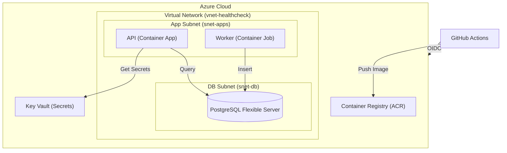

# Healthcheck Dashboard — DevOps Playground (Azure + Go)

A tiny, production-like app built specifically to learn **CI/CD, Terraform, Docker, monitoring, and security on Azure using Go**. The app pings 3 public APIs every minute and shows green/red status, so you spend 90% of your time on infra, not features.

See `PROJECT.md` for full specs and `ROADMAP.md` for the 14-day plan.

## 🎯 Learning Goals

- **Go**: idiomatic HTTP servers, context cancellation, structured logging
- **Docker**: multi-stage builds with distroless, ~12MB images, non-root user
- **Terraform**: AzureRM for VNet, Container Apps, PostgreSQL Flexible Server, Key Vault, Managed Identity, ACR
- **CI/CD**: GitHub Actions with Azure OIDC
- **Observability**: OpenTelemetry Go SDK → Azure Monitor / Application Insights
- **Security**: Key Vault, RBAC least privilege, Trivy scanning, Defender for Cloud

## 🏗️ Architecture (Azure)

```
Browser → Azure Container Apps (Web) → Entra External ID (CIAM)
                          ↓
                   Azure Container Apps (API) → Go API
                          ↓
                   Azure Container Apps Job → Go Worker → Azure Database for PostgreSQL
```

This project uses a **"Clean Split"** architecture: Core infrastructure is automated via Terraform, while Customer Identity (CIAM) is managed as a curated one-time setup for maximum stability.

## 🛠️ Development & Quality

### Code Formatting
This project strictly enforces Go standards. To fix any formatting issues before pushing to GitHub, run:
```powershell
go fmt ./...
```

### Local Testing
To run the full suite of unit tests:
```powershell
go test -v -race ./...
```

### CI/CD Pipelines
*   **🛡️ CI**: Every Pull Request triggers an automated audit of code quality (linting), unit tests, and security scans (Trivy).
*   **🚀 CD**: Every merge to `main` builds new Docker images, pushes them to Azure Container Registry (ACR), and updates the infrastructure via Terraform.


### Infrastructure as Code (Terraform)
We use a modular Terraform structure for maximum maintainability:

| Module | Purpose |
| :--- | :--- |
| `modules/identity` | OIDC/Federated Credentials for passwordless GitHub login. |
| `modules/network` | VNet and Subnets (App & DB) for network isolation. |
| `modules/acr` | Private Docker registry for our hardened images. |

---

## 🛠️ Tech Stack & Security

- **OIDC Authentication**: Passwordless GitHub login to Azure using Workload Identity Federation.
- **Identity (CIAM)**: Entra External ID for customer-facing authentication.
- **Backend API**: Go 1.23, Gin, pgx/v5 (Structured logging with `slog`)
- **Infrastructure**: Terraform ≥1.7 (Modular setup)

## 🚀 Deployment Guide

For a full "Clean Split" deployment walkthrough, see the **[DEPLOYMENT GUIDE](./docs/DEPLOYMENT_GUIDE.md)**.

### 🔐 Environment Files

**`.env.azure`** — Azure credentials for local Terraform (NEVER commit)
```bash
export ARM_SUBSCRIPTION_ID="your-id"
export ARM_TENANT_ID="your-main-tenant-id"
export ARM_CLIENT_ID="your-id-github-actions-bootstrap"
export ARM_USE_OIDC=true

# CIAM Configuration
export TF_VAR_entra_client_id="your-ciam-app-id"
```

Usage:
```bash
source .env          # for go run
source .env.azure    # for terraform
```


- **Backend API**: Go 1.26, Gin, pgx/v5 (Structured logging with `slog`)
- **Worker**: Go 1.26, robfig/cron, shared Postgres store
- **Frontend**: React 19 + Vite + TypeScript + Tailwind CSS 4
- **Database**: PostgreSQL 18 (Local) / Azure Database for PostgreSQL Flexible Server (Cloud)
- **Testing**: Vitest (FE Unit), Playwright (E2E), Go Testing (BE Unit/Integration)
- **Containers**: Docker Compose (Local), Azure Container Apps (Cloud)
- **Infra**: Terraform ≥1.7
- **CI/CD**: GitHub Actions with Azure OIDC

## 📁 Repository Structure

```
.
├── cmd/
│   ├── api/          # HTTP server
│   └── worker/       # Cron worker
├── internal/
│   ├── config/       # env + Key Vault loading
│   ├── handler/      # HTTP handlers
│   ├── store/        # postgres queries
│   └── monitor/      # otel setup
├── web/              # React frontend
├── infra/
│   ├── modules/
│   │   ├── network/
│   │   ├── containerapp/
│   │   ├── postgres/
│   │   └── keyvault/
│   └── envs/dev/
├── .github/workflows/
│   ├── ci.yml
│   └── cd.yml
├── Dockerfile.api
├── Dockerfile.worker
├── docker-compose.yml
├── go.mod
└── PROJECT.md
```

## 🚀 Quick Start (Local Development)

### 1. Launch the Full Stack
This project is fully containerized. You can start the API, Worker, Database, and Frontend with a single command:

```bash
docker-compose up --build
```

- **Dashboard**: [http://localhost:5173](http://localhost:5173)
- **API Health**: [http://localhost:8080/health](http://localhost:8080/health)
- **API Status**: [http://localhost:8080/api/status](http://localhost:8080/api/status)

### 📊 Observability Dashboards
This project includes a full-stack observability suite:

- **Traces (Jaeger)**: [http://localhost:16686](http://localhost:16686)
  - View the "journey" of every request and background ping.
- **Metrics (Prometheus)**: [http://localhost:9090](http://localhost:9090)
  - **API Metrics**: [http://localhost:8080/metrics](http://localhost:8080/metrics)
  - **Worker Metrics**: [http://localhost:8081/metrics](http://localhost:8081/metrics)
  - Try querying: `healthcheck_status_total` or `healthcheck_latency_seconds_bucket`.
  - **P95 Latency Query**: `histogram_quantile(0.95, sum(rate(healthcheck_latency_seconds_bucket[5m])) by (le, target))`

### 2. Verify your Environment
Run the validation script to ensure linting and tests are passing:

```powershell
# Windows
./check.ps1

# Linux/macOS
chmod +x check.sh
./check.sh
```

### 3. Manual Frontend Development
If you want to run the frontend outside of Docker with Hot Module Replacement (HMR):
```bash
cd web
pnpm install
pnpm dev
```

## ☁️ Quick Start (Azure)

1. **Prereqs**: Azure CLI, Terraform ≥1.7, Go 1.26
> **Dev Container tip:** If `terraform` is not found, rebuild with the updated `.devcontainer/devcontainer.json` that installs Terraform via apt (the Node feature breaks on Bookworm).


2. **Create Service Principal**:
   ```bash
   az ad sp create-for-rbac --name "healthcheck-sp"      --role Contributor      --scopes /subscriptions/YOUR-SUBSCRIPTION-ID
   ```

3. **Create `.env.azure`** (never commit):
   ```bash
   export ARM_SUBSCRIPTION_ID="your-id"
   export ARM_TENANT_ID="your-id"
   export ARM_CLIENT_ID="your-id"
   export ARM_CLIENT_SECRET="your-secret"
   ```

4. **Load env and run Terraform**:
   ```bash
   source .env.azure
   cd infra/envs/dev
   terraform init
   terraform fmt
   terraform plan -out tfplan
   terraform apply "tfplan"
   terraform destroy -auto-approve
   ```

5. **Push to main**: CI builds images, pushes to ACR, updates Container Apps

> Do not commit `.env` or `.env.azure`. Add both to `.gitignore`.

## 🔄 CI/CD Flow

**ci.yml (PR)**:
- go vet, go test -race, golangci-lint
- trivy fs --severity HIGH,CRITICAL
- terraform fmt -check && terraform validate

**cd.yml (main)**:
1. azure/login@v2 with Service Principal secrets
2. docker build and push to ACR with $GITHUB_SHA
3. terraform apply -auto-approve
4. az containerapp update
5. smoke test /health

## 📊 Observability

- Logs: `log/slog` with JSON handler → stdout → Log Analytics
- Traces: OpenTelemetry Go SDK → Application Insights
- Metrics: runtime metrics + custom `api_ping_duration_seconds`
- Alerts: P95 latency > 500ms, error rate >1%, worker job failed

## 🛡️ Security Checklist

- [ ] Dockerfile uses distroless, USER nonroot
- [ ] Trivy scan passes in CI
- [ ] No secrets in repo, use Managed Identity + Key Vault for runtime
- [ ] PostgreSQL: private endpoint only, SSL enforced
- [ ] Container App has only "Key Vault Secrets User" role
- [ ] Defender for Cloud enabled on ACR and Container Apps
- [ ] WAF enabled on Front Door

## 📅 14-Day Roadmap

This project is designed as a 2-week playground. See `ROADMAP.md` for daily tasks.

**Week 1 – Local Go + Docker**
- Days 1-3: API skeleton, worker, React frontend
- Days 4-5: Hardened Dockerfiles, slog JSON, OpenTelemetry

**Week 2 – Azure + Terraform + CI/CD**
- Days 6-8: Terraform for network, ACR, Key Vault, Postgres, Container Apps
- Days 9-11: GitHub Actions CI/CD with Service Principal
- Days 12-13: Application Insights, alerts, Defender for Cloud, WAF
- Day 14: Chaos testing and rollback

Stretch goals: blue-green deploys, auto-scale to zero, multi-region with Front Door.

## 🧹 Cleanup

Estimated cost if left running: $5-12/month in dev.

```bash
source .env.azure
cd infra/envs/dev
terraform destroy -auto-approve
```

## 🤖 Using with Meta AI

When asking for help, upload:
1. The file you're editing (e.g., `internal/config/config.go`)
2. `PROJECT.md`
3. One related example

Example: "Based on Dockerfile.api, generate Dockerfile.worker for ./cmd/worker with same distroless hardening."

---
Built to learn DevOps with Go on Azure, by doing, not watching.
