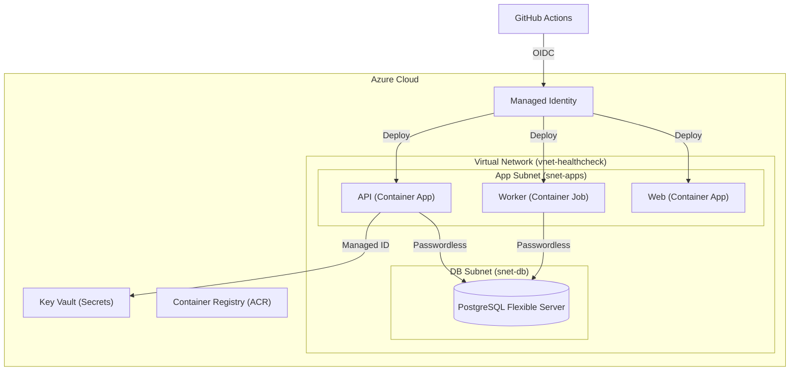

# Healthcheck Dashboard — DevOps Playground (Azure + Go)

A tiny, production-like app built specifically to learn **CI/CD, Terraform, Docker, monitoring, and security on Azure using Go**. The app pings public APIs every minute and shows green/red status, so you spend 90% of your time on infra, not features.

See [ROADMAP.md](./docs/ROADMAP.md) for the full phase plan, and [AGENT_GUIDELINES.md](./docs/AGENT_GUIDELINES.md) for code style and structure standards.

## 🎯 Learning Goals

- **Go**: idiomatic HTTP servers, context cancellation, structured logging, SSE streaming
- **Docker**: multi-stage builds with distroless, ~12MB images, non-root user
- **Terraform**: AzureRM for VNet, Container Apps, PostgreSQL Flexible Server, Key Vault, Managed Identity, ACR
- **CI/CD**: GitHub Actions with Azure OIDC (unified `cicd.yml` pipeline)
- **Observability**: OpenTelemetry Go SDK → Jaeger (local) / Azure Monitor (cloud), Prometheus + Grafana
- **Security**: Key Vault, RBAC least privilege, Trivy scanning, Defender for Cloud, SSRF hardening, JWT role/scope enforcement

## 🏗️ Architecture (Azure)

```
Browser → Entra External ID (CIAM) → Azure Container Apps (Web)
                                               ↓
                                  Azure Container Apps (API) → Go API
                                               ↓
                                  Azure Container Apps Job → Go Worker → Azure Database for PostgreSQL
```

This project uses a **"Clean Split"** architecture: Core infrastructure is automated via Terraform, while Customer Identity (CIAM) is managed as a curated one-time setup for maximum stability.

## 🛠️ Development & Quality

For detailed conventions on styling, code structure, architecture, and testing for both backend, frontend, and infrastructure, please consult the **[Developer & Agent Guidelines](./docs/AGENT_GUIDELINES.md)**.

### Code Formatting
This project strictly enforces Go standards. To fix any formatting issues before pushing to GitHub, run:
```bash
go fmt ./...
```

### Local Testing
To run the full suite of unit tests:
```bash
go test -v -race ./...
```

### CI/CD Pipelines

The pipelines are defined for both GitHub Actions (under `.github/workflows/`) and Azure DevOps (under `.azure-pipelines/`):

| Pipeline File | Platform | Trigger | Purpose |
| :--- | :--- | :--- | :--- |
| `cicd.yml` | GitHub Actions | PR / push to `main` | **Audit** (lint, test, Trivy), **Build** (Docker images → ACR), **Deploy** (update Container Apps) |
| `infra.yml` | GitHub Actions | Push to `main` (infra paths) | Terraform plan & apply |
| `destroy.yml` | GitHub Actions | Manual dispatch | `terraform destroy` for teardown |
| [.azure-pipelines/cicd.yml](file:///mnt/d/Dev/Projects/Healthcheck/.azure-pipelines/cicd.yml) | Azure DevOps | PR / push to `main` | Mirror of `cicd.yml` (Audit, Build, Deploy, Smoke Test) |
| [.azure-pipelines/infra.yml](file:///mnt/d/Dev/Projects/Healthcheck/.azure-pipelines/infra.yml) | Azure DevOps | PR / manual trigger | Mirror of `infra.yml` (Checkov, speculative Plan, manual Apply) |
| [.azure-pipelines/destroy.yml](file:///mnt/d/Dev/Projects/Healthcheck/.azure-pipelines/destroy.yml) | Azure DevOps | Manual trigger | Mirror of `destroy.yml` (manual Destroy with verification) |



### Infrastructure as Code (Terraform)
We use a modular Terraform structure split into environments and reusable modules:

- **Baseline Modules (`infra/modules/common/`)**: Shared modules across all environments.
- **Production Overrides (`infra/modules/pro/`)**: Hardened versions of modules overriding dev behavior to meet strict compliance/security requirements (scanned and verified with Checkov).
- **Environments (`infra/envs/`)**:
  - `dev/`: Development configuration utilizing common baseline modules.
  - `pro/`: Production configuration utilizing common modules but overriding with `pro/` hardened modules.

#### Environment Configuration Comparison

| Component | Dev Setup (`infra/envs/dev`) | Production Setup (`infra/envs/pro`) | Checkov / Security Standards |
| :--- | :--- | :--- | :--- |
| **Network** | VNet + Subnets (`snet-apps`, `snet-db`). NSG allows HTTP (80) & HTTPS (443) from Internet. | VNet + Subnets (`snet-apps`, `snet-db`, **`snet-endpoints`**). NSG **denies HTTP (80)**, allows HTTPS (443). | `CKV_AZURE_160` (HTTP Denied), `CKV2_AZURE_31` (Subnet NSG association) |
| **PostgreSQL** | Flexible Server in private subnet, public network access disabled. | Flexible Server in private subnet, public network access disabled, **Geo-redundant backups enabled**. | `CKV_AZURE_136` (Geo-redundant Backup) |
| **Key Vault** | Purge protection disabled, Network ACL default action Allow, no Private Endpoint. | **Purge protection enabled**, **Public network access disabled**, **Default ACL Deny**, **Private Endpoint enabled** in `snet-endpoints`. | `CKV_AZURE_189` (Public disabled), `CKV_AZURE_109` (Default Deny), `CKV2_AZURE_32` (Private Endpoint), `CKV_AZURE_115` (Purge Protection) |
| **Container Apps** | API, Web, and Worker in private apps subnet. | Same as Dev (`modules/common/containerapp`). | `CKV_AZURE_227` (Private Endpoint / VNet Integration) |
| **Identity & OIDC** | Federated OIDC for deployer, User-Assigned Managed Identity for runtime (passwordless). | Same as Dev (`modules/common/identity`). | Zero-Secret architecture, RBAC least privilege |

---

## 🛠️ Tech Stack & Security

- **Backend API**: Go 1.26, Gin, pgx/v5 (Structured logging with `slog`)
- **Worker**: Go 1.26, robfig/cron, shared Postgres store
- **Frontend**: React 19 + Vite + TypeScript + Tailwind CSS 4 + React Query (TanStack) + Axios + MSAL
- **Database**: PostgreSQL 18 (Local) / Azure Database for PostgreSQL Flexible Server (Cloud)
- **Testing**: Vitest + MSW (FE Unit/Integration), Playwright (E2E), Go Testing (BE Unit/Integration)
- **Containers**: Docker Compose (Local), Azure Container Apps (Cloud)
- **Observability (Local)**: Jaeger (traces), Prometheus (metrics), Grafana (dashboards)
- **Observability (Cloud)**: Azure Monitor, Application Insights, Log Analytics
- **Infra**: Terraform ≥1.7
- **CI/CD**: GitHub Actions and Azure DevOps Pipelines with Azure OIDC/Service Connection
- **Identity (CIAM)**: Entra External ID for customer-facing authentication
- **Security**: Managed Identity (passwordless), Key Vault RBAC, Trivy scanning, SSRF-hardened HTTP client

## 📁 Repository Structure

```
.
├── cmd/
│   ├── api/            # HTTP server (Gin + OTel + SSE broker)
│   ├── worker/         # Cron worker (pings targets, sends webhooks)
│   └── healthcheck/    # Docker HEALTHCHECK binary
├── internal/
│   ├── config/         # env + Key Vault loading
│   ├── handler/        # HTTP handlers + SSE broker + OpenAPI docs
│   ├── middleware/      # JWT auth (AuthMiddleware, RequireRoleOrScope)
│   ├── store/          # postgres queries (pgx/v5)
│   └── monitor/        # OpenTelemetry setup
├── web/                # React frontend (hooks, components, pages, services, types, lib)
│   └── e2e/            # Playwright end-to-end tests
├── infra/
│   ├── bootstrap/      # One-time ACR + Managed Identity + OIDC bootstrap
│   ├── envs/
│   │   ├── dev/        # Development environment configuration
│   │   └── pro/        # Production environment configuration
│   └── modules/
│       ├── common/     # Shared baseline infrastructure modules (acr, auth, containerapp, identity, keyvault, monitor, network, policy, postgres)
│       └── pro/        # Production-specific hardened module overrides (keyvault, network, postgres)
├── grafana/            # Grafana provisioning (datasources + dashboards)
├── .github/workflows/
│   ├── cicd.yml        # Unified CI + CD pipeline
│   ├── infra.yml       # Terraform apply pipeline
│   └── destroy.yml     # Terraform destroy pipeline
├── .azure-pipelines/
│   ├── cicd.yml        # Azure DevOps CI/CD pipeline
│   ├── infra.yml       # Azure DevOps Terraform plan/apply pipeline
│   └── destroy.yml     # Azure DevOps Terraform destroy pipeline
├── prometheus.yml      # Prometheus scrape config
├── Dockerfile.api
├── Dockerfile.worker
├── docker-compose.yml
├── go.mod
└── go.sum
```

## 🎓 Learning Center

If you want to understand how this project works, follow our **Masterclass Curriculum**:

1. [Lesson 01: Architecture Overview](./docs/lessons/01-architecture-overview.md) — The "Big Picture."
2. [Lesson 02: Go Microservices](./docs/lessons/02-go-microservices.md) — Identity-aware Go code.
3. [Lesson 03: Infrastructure as Code](./docs/lessons/03-infrastructure-as-code.md) — The Terraform blueprint.
4. [Lesson 04: Azure Container Apps](./docs/lessons/04-azure-container-apps.md) — Scaling & Resilience.
5. [Lesson 05: CI/CD & Security](./docs/lessons/05-cicd-and-security.md) — Automating the "Castle."

---

## 🚀 Quick Start (Local Development)

### 1. Launch the Full Stack
This project is fully containerized. You can start the API, Worker, Database, Frontend, and Observability stack with a single command:

```bash
docker-compose up --build
```

- **Dashboard**: [http://localhost:5173](http://localhost:5173)
- **API Health**: [http://localhost:8080/health](http://localhost:8080/health)
- **API Status**: [http://localhost:8080/api/status](http://localhost:8080/api/status)
- **API Documentation (Scalar)**: [http://localhost:8080/docs](http://localhost:8080/docs) (Interactive playground with Entra ID and manual Bearer Token authentication support)

### 📊 Observability Dashboards
This project includes a full-stack observability suite:

- **Traces (Jaeger)**: [http://localhost:16686](http://localhost:16686)
  - View the "journey" of every request and background ping.
- **Metrics (Prometheus)**: [http://localhost:9090](http://localhost:9090)
  - **API Metrics**: [http://localhost:8080/metrics](http://localhost:8080/metrics)
  - **Worker Metrics**: [http://localhost:8081/metrics](http://localhost:8081/metrics)
  - Try querying: `healthcheck_status_total` or `healthcheck_latency_seconds_bucket`.
  - **P95 Latency Query**: `histogram_quantile(0.95, sum(rate(healthcheck_latency_seconds_bucket[5m])) by (le, target))`
- **Dashboards (Grafana)**: [http://localhost:3000](http://localhost:3000) (anonymous access, pre-provisioned with Prometheus datasource)

### 2. Verify your Environment
Run the validation script to ensure linting and tests are passing:

```powershell
# Windows
./check.ps1

# Linux/macOS
chmod +x check.sh
./check.sh
```

### 3. Manual Frontend Development
If you want to run the frontend outside of Docker with Hot Module Replacement (HMR):
```bash
cd web
pnpm install
pnpm run dev
```

## ☁️ Quick Start (Azure)

1. **Prereqs**: Azure CLI, Terraform ≥1.8, Go 1.26

2. **OIDC Bootstrap**:
   - Run Terraform in `infra/bootstrap` to create the ACR and the OIDC Managed Identity.
   - Configure your GitHub repository with the `AZURE_CLIENT_ID`, `AZURE_TENANT_ID`, and `AZURE_SUBSCRIPTION_ID`.

3. **Deploy Infrastructure**:
   Deploy either environment (e.g., `dev` or `pro`):
   ```bash
   # For Dev
   cd infra/envs/dev
   # For Pro
   # cd infra/envs/pro

   terraform init
   terraform plan
   terraform apply
   ```

4. **Push to main**: The `cicd.yml` pipeline handles the rest via OIDC — audit, build images, push to ACR, and update Container Apps.

> Do not commit `.env` or `.env.azure`. Both are listed in `.gitignore`.

### 🔐 Environment Files

**`.env.azure`** — Azure credentials for local Terraform (NEVER commit)
```bash
export ARM_SUBSCRIPTION_ID="your-id"
export ARM_TENANT_ID="your-main-tenant-id"
export ARM_CLIENT_ID="your-id-github-actions-bootstrap"
export ARM_USE_OIDC=true

# CIAM Configuration
export TF_VAR_entra_client_id="your-ciam-app-id"
```

Usage:
```bash
source .env          # for go run / docker-compose
source .env.azure    # for terraform
```

## 🔄 CI/CD Flow

**`cicd.yml` (PR + push to `main`)** — 3 sequential stages:
1. **Audit**: `gofmt`, `go vet`, `go test -race`, Trivy `fs` scan
2. **Build** *(push to `main` only)*: Docker build + push API/Worker/Web images to ACR with short Git SHA tag
3. **Deploy** *(after build)*: `az containerapp update` for API & Web; `az containerapp job update` for Worker

**`infra.yml` (push to `main`, infra paths)**:
- `terraform fmt -check`, `terraform validate`, `terraform plan`, `terraform apply`

## 📊 Observability

- **Logs**: `log/slog` with JSON handler → stdout → Log Analytics (Azure)
- **Traces**: OpenTelemetry Go SDK → Jaeger (local) / Application Insights (Azure)
- **Metrics**: Prometheus scrape endpoint + custom `healthcheck_status_total` and `healthcheck_latency_seconds_bucket`
- **Dashboards**: Grafana (local) with pre-provisioned Prometheus datasource
- **Alerts**: P95 latency > 500ms, error rate >1%, worker job failed

## 🛡️ Security Checklist

- [x] Dockerfile uses distroless base image, `USER nonroot`
- [x] Checkov security auditing (Infra-as-Code compliance)
- [x] Zero-Secret Runtime: Managed Identity for Postgres and Key Vault
- [x] Network Isolation: Postgres VNet Injection + Private DNS
- [x] Hardened Ingress: HTTPS-only, CORS restricted, Port 22 blocked (NSG)
- [x] Cost Optimization: Scale-to-Zero for API and Web
- [x] Resilience: Blue-Green deployments with automatic rollback
- [x] OIDC Authentication: Secretless GitHub Actions deployment
- [x] RBAC Enforcement: `RequireRoleOrScope` middleware on `POST/DELETE /api/targets` (requires `Healthcheck.Admin` role)
- [x] SSRF Hardening: Custom `CheckRedirect` on worker HTTP client blocks private/internal IP redirects (max 3 hops)
- [x] Toast Notifications: Non-blocking error feedback on frontend (no native browser alerts)

## 📅 Roadmap Summary

**Week 1 – Local Go + Docker** ✅
- [x] API skeleton, worker, React frontend
- [x] Hardened Dockerfiles, slog JSON, OpenTelemetry

**Week 2 – Azure + Terraform + CI/CD** ✅
- [x] Terraform for network, ACR, Key Vault, Postgres, Container Apps
- [x] GitHub Actions CI/CD with OIDC (Passwordless)
- [x] Application Insights, alerts, and dashboards
- [x] Chaos engineering (Poison Pill) and automatic rollback
- [x] Stretch goals: Blue-Green deploys, Auto-Scale to Zero

**Phase 9 – Production Enhancements** ✅
- [x] Dynamic Targets CRUD (React UI + REST API endpoints)
- [x] Latency Sparklines & State Ticks visualization
- [x] State-Transition Webhook Alerting (Slack/Discord)
- [x] 24h/7d SLA calculation & percentage badges
- [x] Hardened Synthetic Monitoring (method, headers, expected status, body matching)
- [x] Worker Robustness & Alert De-noising (failure thresholds, jitter)
- [x] Security & RBAC Hardening (SSRF protection, `RequireRoleOrScope`, admin-only mutations)
- [x] Observability & Performance (W3C distributed tracing, SLA caching, Grafana dashboards)
- [x] Frontend & UX Enhancements (SSE real-time updates, Light/Dark theme toggle, SRE Incident Log modal)

## 🧹 Cleanup

Estimated cost if left running: $5-12/month in dev, $20-40/month in prod (due to geo-redundant backups/endpoints).

```bash
source .env.azure

# To destroy Dev
cd infra/envs/dev
terraform destroy -auto-approve

# To destroy Pro
# cd infra/envs/pro
# terraform destroy -auto-approve
```

## 🤖 Using an AI Assistant

When asking for help, upload:
1. The file you're editing (e.g., [config.go](./internal/config/config.go))
2. One related example or module file

Example: "Based on Dockerfile.api, generate Dockerfile.worker for ./cmd/worker with same distroless hardening."

---
Built to learn DevOps with Go on Azure, by doing, not watching.
