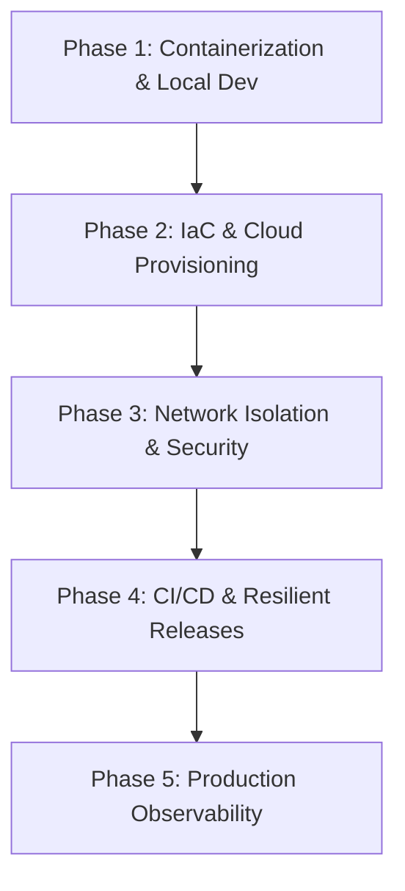

# 🎓 DevOps & SRE Study Plan: Interview Mastery

This directory contains a structured study plan designed to take a Backend Software Engineer and prepare them for a professional DevOps, SRE, or Cloud Platform Engineering role using the **Healthcheck Dashboard** codebase as a live learning sandbox.

---

## 🗺️ The 5-Phase DevOps Learning Roadmap

To master these concepts, do not just read the files. Complete each phase by studying the related code, testing the behaviors locally, and reviewing the linked interview questions.

---

### 📦 Phase 1: Containerization & Local Dev Parity
*   **Goal:** Master the packaging of microservices and maintaining local-to-cloud environment parity.
*   **Concepts to Learn:**
    *   Multi-stage Docker builds and the security value of `distroless` base images.
    *   Running containers under non-root permissions.
    *   Docker Compose networking and service orchestration.
*   **Code Sandbox Files to Explore:**
    *   [Dockerfile.api](file:///mnt/d/Dev/Projects/Healthcheck/Dockerfile.api) & [Dockerfile.worker](file:///mnt/d/Dev/Projects/Healthcheck/Dockerfile.worker) (Multi-stage configurations).
    *   [docker-compose.yml](file:///mnt/d/Dev/Projects/Healthcheck/docker-compose.yml) (Local services, networking, and environment overrides).
*   **Linked Interview Questions:**
    *   *Q5: Multi-stage & Distroless builds* ([devops_interview_questions.md](file:///mnt/d/Dev/Projects/Healthcheck/docs/interview/devops_interview_questions.md#q5-i-see-you-used-go-for-the-backend-how-did-you-structure-your-dockerfiles-to-ensure-security-and-performance))
    *   *Q6: Why Azure Container Apps over AKS?* ([devops_interview_questions.md](file:///mnt/d/Dev/Projects/Healthcheck/docs/interview/devops_interview_questions.md#q6-why-did-you-choose-azure-container-apps-aca-instead-of-azure-kubernetes-service-aks-for-hosting-this-application))

---

### 🏗️ Phase 2: Infrastructure as Code (IaC) & Environments
*   **Goal:** Understand declarative infrastructure provisioning, modular design, and environment promotion.
*   **Concepts to Learn:**
    *   Terraform state management and backends.
    *   Modular infrastructure (`common` reusable modules vs. `pro` overrides).
    *   Comparing Terraform to Azure Bicep.
*   **Code Sandbox Files to Explore:**
    *   [infra/terraform/environments/dev/main.tf](file:///mnt/d/Dev/Projects/Healthcheck/infra/terraform/environments/dev/main.tf)
    *   [infra/terraform/environments/pro/main.tf](file:///mnt/d/Dev/Projects/Healthcheck/infra/terraform/environments/pro/main.tf)
    *   [infra/terraform/modules/](file:///mnt/d/Dev/Projects/Healthcheck/infra/terraform/modules/)
*   **Linked Interview Questions:**
    *   *Q3: Dev vs. Pro Infrastructure differences* ([devops_interview_questions.md](file:///mnt/d/Dev/Projects/Healthcheck/docs/interview/devops_interview_questions.md#q3-what-is-the-difference-between-how-you-configured-networking-in-your-development-environment-versus-your-production-environment))
    *   *Scenario 1: Zero-Replica Cold Start & KEDA Autoscaling* ([advanced_scenarios.md](file:///mnt/d/Dev/Projects/Healthcheck/docs/interview/advanced_scenarios.md#scenario-1-the-zero-replica-cold-start-problem))

---

### 🔒 Phase 3: Cloud Security, Identity, & Network Isolation
*   **Goal:** Secure the cloud perimeter, implement zero-trust networking, and configure passwordless access.
*   **Concepts to Learn:**
    *   Passwordless auth via User-Assigned Managed Identities and Azure RBAC.
    *   GitHub OIDC (OpenID Connect) federation.
    *   Network isolation using Private Subnets, NSGs, Private Endpoints, and Private DNS Zones.
*   **Code Sandbox Files to Explore:**
    *   [infra/terraform/modules/common/identity/](file:///mnt/d/Dev/Projects/Healthcheck/infra/terraform/modules/common/identity/) (Managed identity setup).
    *   [infra/terraform/modules/pro/network/](file:///mnt/d/Dev/Projects/Healthcheck/infra/terraform/modules/pro/network/) (Production private subnets & endpoints).
    *   [infra/terraform/modules/pro/postgres/](file:///mnt/d/Dev/Projects/Healthcheck/infra/terraform/modules/pro/postgres/) (Passwordless DB access block).
*   **Linked Interview Questions:**
    *   *Q1: Zero-Secret Architecture* ([devops_interview_questions.md](file:///mnt/d/Dev/Projects/Healthcheck/docs/interview/devops_interview_questions.md#q1-you-mentioned-your-project-has-a-zero-secret-architecture-how-did-you-implement-this-and-why-is-it-better-than-traditional-api-keys-or-connection-strings))
    *   *Q2: Pipeline OIDC Integration* ([devops_interview_questions.md](file:///mnt/d/Dev/Projects/Healthcheck/docs/interview/devops_interview_questions.md#q2-how-did-you-secure-your-cicd-pipelines-connecting-to-azure-did-you-store-azure-service-principal-client-secrets-in-github))
    *   *Q4: Private Endpoints vs. Service Endpoints* ([devops_interview_questions.md](file:///mnt/d/Dev/Projects/Healthcheck/docs/interview/devops_interview_questions.md#q4-why-did-you-use-private-endpoints-for-the-key-vault-instead-of-just-service-endpoints))
    *   *Scenario 3: Troubleshooting Network Timeout/403* ([advanced_scenarios.md](file:///mnt/d/Dev/Projects/Healthcheck/docs/interview/advanced_scenarios.md#scenario-3-troubleshooting-key-vault-inaccessible-403--network-timeout))

---

### 🔄 Phase 4: CI/CD Quality Gates & Release Safety
*   **Goal:** Build automated, secure, and self-healing deployment pipelines.
*   **Concepts to Learn:**
    *   CI stages: Linting, Unit testing, static analysis security scanning (Checkov/Trivy).
    *   Enforcing test coverage metrics as pipeline gates.
    *   CD stages: Smoke tests, blue-green routing, and automated rollback triggers.
*   **Code Sandbox Files to Explore:**
    *   [.github/workflows/cicd.yml](file:///mnt/d/Dev/Projects/Healthcheck/.github/workflows/cicd.yml)
    *   [.azure-pipelines/cicd.yml](file:///mnt/d/Dev/Projects/Healthcheck/.azure-pipelines/cicd.yml)
*   **Linked Interview Questions:**
    *   *Q7: Deployment failure & Automated rollbacks* ([devops_interview_questions.md](file:///mnt/d/Dev/Projects/Healthcheck/docs/interview/devops_interview_questions.md#q7-if-a-deployment-to-production-fails-its-health-checks-how-does-your-pipeline-handle-the-situation))
    *   *Q8: Quality gates & Checkov scanning* ([devops_interview_questions.md](file:///mnt/d/Dev/Projects/Healthcheck/docs/interview/devops_interview_questions.md#q8-how-do-you-enforce-quality-gates-in-your-pipeline-before-code-reaches-production))
    *   *Scenario 2: Database Schema Migration Race Conditions* ([advanced_scenarios.md](file:///mnt/d/Dev/Projects/Healthcheck/docs/interview/advanced_scenarios.md#scenario-2-rolling-releases--database-migration-race-conditions))

---

### 📊 Phase 5: Production Observability & SRE
*   **Goal:** Gain deep visibility into application health, performance bottlenecks, and service interactions.
*   **Concepts to Learn:**
    *   Distributed Tracing using OpenTelemetry and passing context headers (`traceparent`).
    *   Prometheus metric scraping and Grafana dashboard visualization.
    *   Configuring production alerts based on error thresholds.
*   **Code Sandbox Files to Explore:**
    *   [internal/monitor/otel.go](file:///mnt/d/Dev/Projects/Healthcheck/internal/monitor/otel.go) (OpenTelemetry initialization).
    *   [grafana/provisioning/](file:///mnt/d/Dev/Projects/Healthcheck/grafana/) (Local Grafana dashboards).
*   **Linked Interview Questions:**
    *   *Q9: Distributed Tracing & W3C standard* ([devops_interview_questions.md](file:///mnt/d/Dev/Projects/Healthcheck/docs/interview/devops_interview_questions.md#q9-explain-how-w3c-distributed-tracing-works-in-your-go-services-and-why-we-need-it))
    *   *Q10: Switching telemetry backends (Jaeger vs. App Insights)* ([devops_interview_questions.md](file:///mnt/d/Dev/Projects/Healthcheck/docs/interview/devops_interview_questions.md#q10-how-did-you-configure-open-telemetry-to-export-to-jaeger-locally-but-application-insights-in-the-cloud-without-modifying-the-application-code))
    *   *Scenario 4: Cron concurrency & overlaps* ([advanced_scenarios.md](file:///mnt/d/Dev/Projects/Healthcheck/docs/interview/advanced_scenarios.md#scenario-4-cron-job-execution-overlap))

---

## 🛡️ SRE Security & Advanced Incident Response

To prepare for dedicated security operations, live incident response, and supply chain vulnerability questions, review the **[Security & Advanced Troubleshooting Guide](file:///mnt/d/Dev/Projects/Healthcheck/docs/interview/security_and_troubleshooting.md)**.

---

## 📚 General DevOps Foundations (Core Linux, Networking, Git, SQL)

To prepare for general systems engineering and infrastructure screening rounds (not specific to this project), review the core concepts in the **[Classic DevOps Foundations Guide](file:///mnt/d/Dev/Projects/Healthcheck/docs/interview/classic_devops_foundations.md)**.

---

## 🐹 Go (Golang) Language Technical Questions

To prepare for backend systems and language-specific questions related to this project, review the **[Go Language Interview Guide](file:///mnt/d/Dev/Projects/Healthcheck/docs/interview/golang_interview_questions.md)**.

---

## ⚛️ React & Frontend Engineering Questions

To prepare for client-side, UI state management, and MSAL authentication questions related to this project, review the **[React & Frontend Interview Guide](file:///mnt/d/Dev/Projects/Healthcheck/docs/interview/react_interview_questions.md)**.

---

## 🐘 PostgreSQL Database Technical Questions

To prepare for database internals, MVCC locks, indexing, and migration queries related to this project, review the **[PostgreSQL Database Interview Guide](file:///mnt/d/Dev/Projects/Healthcheck/docs/interview/postgres_interview_questions.md)**.

---

## 🛠️ Next Step: Hands-On Troubleshooting Drills

To solidify your learning, go to the [Troubleshooting Drills Guide](file:///mnt/d/Dev/Projects/Healthcheck/docs/interview/troubleshooting_drills.md) to practice debugging real infrastructure failures on this codebase.
