# Lesson 01: Architecture Overview 🗺️

Welcome to the deep dive! Before we write any code or deploy any cloud resources, we must understand the "Big Picture." This project is not just a simple web application; it represents a production-grade, highly secure **Microservices Ecosystem** deployed in the cloud.

---

## 🏗️ The High-Level Architecture

Here is the architectural blueprint of what we are building. The system partitions components based on the security principles of **Identity**, **Compute**, **Data**, **Isolation**, and **Observability**.

```mermaid
graph TB
    %% Styling Class Declarations
    classDef external fill:#f9f9f9,stroke:#333,stroke-width:2px,stroke-dasharray: 5 5;
    classDef azure fill:#e1f5fe,stroke:#0288d1,stroke-width:2px;
    classDef network fill:#efebe9,stroke:#5d4037,stroke-width:2px;
    classDef security fill:#eceff1,stroke:#607d8b,stroke-width:2px;
    classDef monitor fill:#efe8ff,stroke:#673ab7,stroke-width:2px;
    classDef database fill:#e8f5e9,stroke:#2e7d32,stroke-width:2px;

    %% Subgraphs
    subgraph External ["External World (Public Internet)"]
        Browser["User Browser"]:::external
        CIAM["Entra External ID (CIAM)"]:::external
        GH["GitHub Actions Runner"]:::external
        PublicAPIs["3x Public APIs (Healthcheck Targets)"]:::external
    end

    subgraph BootstrapRG ["Azure Bootstrap (rg-healthcheck-bootstrap)"]
        ACR["Container Registry (ACR)"]:::azure
        StateDB["Terraform State (Storage Account)"]:::azure
    end

    subgraph DevRG ["Azure Dev Resource Group (rg-healthcheck-dev)"]
        subgraph VNet ["Virtual Network (vnet-healthcheck-dev: 10.0.0.0/16)"]
            subgraph AppsSubnet ["Apps Subnet (snet-apps: 10.0.1.0/24)"]
                WebApp["Web App (React Frontend Container)"]:::network
                APIApp["API App (Go Gin Backend Container)"]:::network
                WorkerJob["Worker Job (Go Cron Container Job)"]:::network
            end

            subgraph DataSubnet ["Data Subnet (snet-db: 10.0.2.0/24)"]
                DB["PostgreSQL Flexible Server"]:::database
                DNS["Private DNS Zone (postgres.database.azure.com)"]:::database
            end
        end

        KV["Azure Key Vault"]:::security
        
        subgraph EntraID ["Identities (Microsoft Entra ID)"]
            GithubID["Deployment Identity (id-github-actions-dev)"]:::security
            RuntimeID["Runtime Identity (id-healthcheck-apps-dev)"]:::security
        end

        subgraph Observability ["Observability Suite"]
            LAW["Log Analytics Workspace"]:::monitor
            AppInsights["Application Insights (OpenTelemetry)"]:::monitor
            ActionGroup["Action Group (Email & Webhook Alerts)"]:::monitor
        end
    end

    %% Edge Definitions - Authentication & CI/CD
    GH -->|1. OIDC Auth| GithubID
    GH -->|2. Push Images| ACR
    GithubID -.->|3. Manage and Deploy| WebApp
    GithubID -.->|3. Manage and Deploy| APIApp
    GithubID -.->|3. Manage and Deploy| WorkerJob
    
    %% Edge Definitions - Ingress & User Traffic
    Browser -->|1. Login Redirect| CIAM
    Browser -->|2. Access HTTPS Port 443| WebApp
    WebApp -->|3. API Calls HTTPS Port 8080 and CORS| APIApp

    %% Edge Definitions - App Runtime & Isolation
    WebApp -.->|Uses Identity| RuntimeID
    APIApp -.->|Uses Identity| RuntimeID
    WorkerJob -.->|Uses Identity| RuntimeID

    RuntimeID -.->|AcrPull Permission| ACR
    RuntimeID -.->|Secrets Read| KV
    RuntimeID -.->|Passwordless Connection| DB

    %% Database Private Connection
    APIApp ==>|Port 5432 Private VNet Link| DB
    WorkerJob ==>|Port 5432 Private VNet Link| DB
    DNS -.->|Resolves FQDN to Private IP| DB

    %% Outbound Traffic & Jobs
    WorkerJob -->|HTTP Pings Every Minute| PublicAPIs

    %% Observability Connections
    WebApp --->|Console Logs| LAW
    APIApp --->|Console Logs| LAW
    WorkerJob --->|Console Logs| LAW
    APIApp --->|OTel Traces and Metrics| AppInsights
    WorkerJob --->|OTel Traces and Metrics| AppInsights
    AppInsights -.->|Alert Triggers| ActionGroup
    LAW -.->|Log Alerts| ActionGroup
```

---

## 🔍 Detailed Component Breakdown

For a developer new to cloud architectures, the terms above can feel overwhelming. Let’s break down what each block is and why it exists:

### 1. Resource Groups
*   **Dev Resource Group (`rg-healthcheck-dev`)**: A logical folder in your Azure subscription hosting the active development environment (VNet, container apps, database, key vault).
*   **Bootstrap Resource Group (`rg-healthcheck-bootstrap`)**: Houses the long-lived, foundational components like the storage account for Terraform state and the private [Azure Container Registry (ACR)](file:///mnt/d/Dev/Projects/Healthcheck/infra/terraform/bootstrap).
*   **Why it matters:** It separates initial registry setup from ongoing app deployment lifecycles, and enables clean resource cleanup.

### 2. Virtual Network (VNet) & Subnets
A **Virtual Network (VNet)** is your private sandbox in the cloud, completely isolated from the public internet.
*   **IP Address Allocation:** We assign a range of private IP addresses (`10.0.0.0/16`, giving us 65,536 private IPs) that can only be reached within this network.
*   **Subnets:** We slice the VNet into smaller `/24` segments (256 IPs each) for different security tiers:
    *   **Apps Subnet (`snet-apps`)**: Delegated to `Microsoft.App/environments` for running our containerized applications inside [modules/containerapp](file:///mnt/d/Dev/Projects/Healthcheck/infra/terraform/modules/common/containerapp).
    *   **Data Subnet (`snet-db`)**: Delegated to `Microsoft.DBforPostgreSQL/flexibleServers` for running the database inside [modules/postgres](file:///mnt/d/Dev/Projects/Healthcheck/infra/terraform/modules/common/postgres).
*   **Network Security Groups (NSGs):** Firewalls applied at the subnet level. `nsg-db` ensures that the PostgreSQL server only accepts incoming database requests (Port 5432) from the `snet-apps` subnet IP range. All other entry paths are blocked.

### 3. Managed Identity
To communicate securely, Azure uses **Managed Identities** mapped inside Entra ID (Active Directory), completely eliminating the need for hardcoded credentials.
*   **Deployment Identity (`id-github-actions-dev`)**: Used by GitHub Actions via Workload Identity Federation (OIDC) to securely authenticate with Azure and manage infrastructure deployment.
*   **Runtime Identity (`id-healthcheck-apps-dev`)**: Attached to our Container Apps, granting them passwordless authentication permissions to Azure SQL, Key Vault, and ACR.
*   **Why it matters:** Zero passwords are written in our codebase or configuration files!

### 4. Azure Key Vault (KV)
A hardened, secure storage facility for secrets, certificates, and API keys created by [modules/keyvault](file:///mnt/d/Dev/Projects/Healthcheck/infra/terraform/modules/common/keyvault).
*   **Role-Based Access Control (RBAC):** We grant the Runtime Identity the `Key Vault Secrets User` role, allowing containers to read settings like the alert webhook URL securely.

### 5. Azure Container Apps (ACA)
A serverless container hosting platform built on Kubernetes (AKS), Envoy, and KEDA, configured in [modules/containerapp](file:///mnt/d/Dev/Projects/Healthcheck/infra/terraform/modules/common/containerapp).
*   **Web App**: A container running our React 19 + Vite dashboard, exposed to the internet via public ingress.
*   **API App**: A container running our Go HTTP backend, internally accessible to the frontend container, and featuring CORS restriction.
*   **Worker Job**: A run-to-completion container job triggered on a cron schedule (every minute) to query public API health and record stats in PostgreSQL.

### 6. Observability Suite
A robust monitoring setup defined in [modules/monitor](file:///mnt/d/Dev/Projects/Healthcheck/infra/terraform/modules/common/monitor).
*   **Log Analytics Workspace**: The central repository for all container console outputs (stdout/stderr) which are exported in structured JSON via `slog`.
*   **Application Insights**: Captures telemetry, spans, and traces sent from the Go OpenTelemetry SDK.
*   **Azure Monitor Alerts**: Automated alerting configurations that email or ping a webhook if average response time exceeds 500ms or HTTP 5xx errors spike.

### 7. Customer Identity (Entra External ID)
Our CIAM (Customer Identity & Access Management) solution. The React frontend integrates with Entra External ID so users are redirected to sign in securely before getting access to dashboard data.

---

## 🛡️ Core Design Principles

When designing and building modern cloud-native systems, we adhere to four critical principles:

### 1. Zero-Secret Runtime 🔐
We operate under the assumption that *any hardcoded credential will eventually be leaked*.
*   We do not store database passwords in cleartext.
*   Instead, our Go application uses its **Managed Identity** to request a temporary access token from Entra ID specifically scoped for PostgreSQL. This token acts as the database password and expires automatically.

### 2. Private Subnet Injection (Network Sandboxing) 🚧
A database should never have a public IP address.
*   Our PostgreSQL server is "injected" into `snet-db`.
*   There is no route from the public internet to this database.
*   Even if someone knows the database hostname and has a valid password, they cannot connect unless they are executing code *inside* the VNet.

### 3. Event-Driven & Scalable Architecture 🚀
*   **Scale-to-Zero:** If no users are viewing the dashboard, our Container Apps scale down to 0 replicas. This means we pay $0 for CPU/Memory during idle hours.
*   **Automatic Scaling:** As soon as HTTP requests arrive, ACA dynamically spins up replicas to handle the load and scales back down when the spikes subside.

### 4. Infrastructure as Code (IaC) 🏗️
Human error is the leading cause of cloud misconfigurations.
*   Every virtual network, firewall rule, role assignment, and database parameter is defined in **Terraform** files.
*   This makes our infrastructure fully auditable, version-controlled, and reproducible in minutes.

---

## 📖 Glossary of Terms for Beginners

| Term | Analogy | Description |
| :--- | :--- | :--- |
| **VNet** | A fenced castle | A private, isolated network space in the cloud. |
| **Subnet** | Rooms inside the castle | A split division within a VNet for grouping related services. |
| **Managed Identity** | A building access badge | An auto-managed identity in Entra ID used by services to authenticate securely. |
| **OIDC** | A temporary guest pass | OpenID Connect, allowing third-parties (like GitHub) to authenticate temporarily. |
| **Checkov** | A building inspector | A static analysis tool that scans Terraform files for security vulnerabilities. |
| **Distroless** | A bare room with just a desk | A minimal container image containing only your binary, removing standard tools like shell/bash to prevent attacks. |
| **ACR** | Secure warehouse | Azure Container Registry, used to securely store and distribute private container images. |
| **LAW** | Central filing cabinet | Log Analytics Workspace, collecting stdout/stderr output from all services. |
| **App Insights** | Heart monitor | Application Insights, receiving OpenTelemetry metrics and traces to trace request flows. |
| **CIAM** | Security gatekeeper | Customer Identity & Access Management (Entra External ID) handling user logins. |

---

### Next Steps 🚀
Now that you have a firm grasp of the environment structure, let's explore **[Lesson 02: Go Microservices](file:///mnt/d/Dev/Projects/Healthcheck/docs/learn/02-go-microservices.md)** to see how Go translates these concepts into working code.
