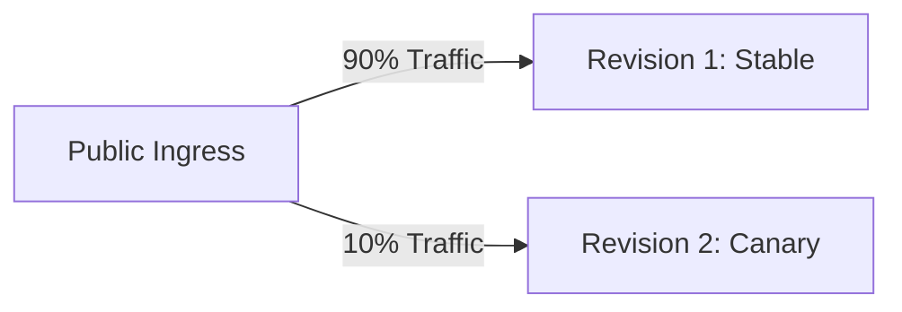

# Lesson 04: Azure Container Apps 🚀🌀

Azure Container Apps (ACA) is our cloud platform for deploying containers. Under the hood, ACA runs on **Kubernetes (AKS)**, uses **KEDA** for scaling, and leverages **Envoy** as an ingress proxy—but it hides all this complexity, giving you the power of Kubernetes without the administrative overhead.

---

## 📁 1. The Container Sandbox Infrastructure

Before running any containers, we provision the control plane and administrative backing resources:

### A. The Log Analytics Workspace
A centralized logging database. All stdout (standard output) and stderr (standard error) logs printed by our Go binaries are automatically piped here.
*   **Log Retention:** Configured for 30 days to optimize cost while keeping enough historical data for troubleshooting.

### B. The Container App Environment (CAE)
The CAE represents the secure boundary (virtual cluster) enclosing our apps. By linking the CAE to our virtual network subnet (`infrastructure_subnet_id = var.subnet_id`), all containers inside it are placed into the private network space. They can talk to the database securely and call each other over internal DNS names.

### C. ACR Role Mappings (`AcrPull`)
Our Azure Container Registry (ACR) is private. To pull Docker images, we assign the User-Assigned Managed Identity of the Container App the **`AcrPull`** role over the registry.
*   **Security Win:** No passwords or docker registry keys are hardcoded in the deployment configs.

---

## 💤 2. Autoscaling & KEDA (Scale-to-Zero)

One of the best cost-saving features of serverless container hosting is **Scale-to-Zero**:

```hcl
template {
  min_replicas = 0
  max_replicas = 3
}
```

### How KEDA Works
**KEDA** (Kubernetes Event-driven Autoscaling) monitors external triggers. For our web API, the trigger is HTTP traffic.
1.  **Scaling Down:** If the system detects 0 requests for 5 minutes (the cool-down period), KEDA terminates all running container replicas. The application consumes **zero** CPU and memory, costing you **$0**.
2.  **Scaling Up (Cold Start):** When a user visits the dashboard, the public ingress routes the request. KEDA detects the request, provisions a new container, and boots it.
3.  **The Go Advantage:** Because Go compiles to a single, highly optimized native binary (with no heavy JVM or node_modules to load), our cold starts take less than 1-2 seconds.

---

## 🔄 3. Revisions & Traffic Splitting

By running in `revision_mode = "Multiple"`, every change to our code or configuration creates a new **Revision** (an immutable snapshot of the application state).



*   **Canary Deployments:** We can route 90% of our traffic to the stable revision, and send 10% to the newly deployed revision to verify it works under real-world load without risking a major outage.
*   **Automatic Rollback:** If a new revision fails its startup checks or health probes, ACA keeps 100% of traffic routing to the old revision.
*   **Terraform Lifecycle Rule:** In our Terraform modules, we add `ignore_changes = [ingress[0].traffic_weight]`. This prevents Terraform from overwriting manual traffic splitting allocations during subsequent runs, allowing developers to manually shift traffic weights in the Azure Portal or CLI during a live release.

---

## 🏃‍♂️ 4. Apps vs. Jobs

We run two distinct compute models inside Azure Container Apps:

*   **`azurerm_container_app` (The API/Web)**: A long-running service that listens on an HTTP port. It stays active to serve requests and scales up/down dynamically based on traffic concurrency.
*   **`azurerm_container_app_job` (The Worker & Migration Runner)**: A process designed for short-lived, run-to-completion tasks. It does not expose a public HTTP port or listen for requests. We use two different trigger models for our container jobs:
    1. **Scheduled Triggers (The Worker)**: Triggered automatically on a **Cron Schedule** (`cron_expression`). It boots up, pings our target sites, logs the check in PostgreSQL, and immediately terminates.
    2. **On-Demand Triggers (The Migration Runner)**: Triggered manually (`manual` trigger type) by our CI/CD pipeline on every deployment. It boots up, runs our database migrations, and exits. If it exits with a non-zero status (failure), the pipeline detects this and stops the deployment immediately.

---

## 🔎 5. Troubleshooting Logs with Kusto (KQL)

Because all container stdout/stderr logs are collected in our **Log Analytics Workspace**, we can query them using **KQL (Kusto Query Language)** inside the Azure Portal.

Here are three essential KQL queries for troubleshooting:

### A. View All Application Logs
Use this to see all messages printed by your Go application's structured logger:
```kusto
ContainerAppConsoleLogs_CL
| where ContainerAppName_s startswith "ca-healthcheck-api"
| project TimeGenerated, Log_s
| order by TimeGenerated desc
| limit 100
```

### B. Search for Error Messages
Filters the logs to show only entries containing the word "error" or failing connections:
```kusto
ContainerAppConsoleLogs_CL
| where Log_s contains "error" or Log_s contains "failed"
| project TimeGenerated, ContainerName_s, Log_s
| order by TimeGenerated desc
```

### C. Check Worker Execution Status
Queries the execution history of our background cron job to verify it is completing successfully:
```kusto
ContainerAppSystemLogs_CL
| where ComponentType_s == "ContainerAppJob"
| project TimeGenerated, Reason_s, Log_s
| order by TimeGenerated desc
```

---

### Next Steps 🚀
Now that we understand how our containers scale and report status, let's explore **[Lesson 05: CI/CD & Security Compliance](file:///mnt/d/Dev/Projects/Healthcheck/docs/learn/05-cicd-and-security.md)** to see how we build automated security audits and deployment pipelines.
