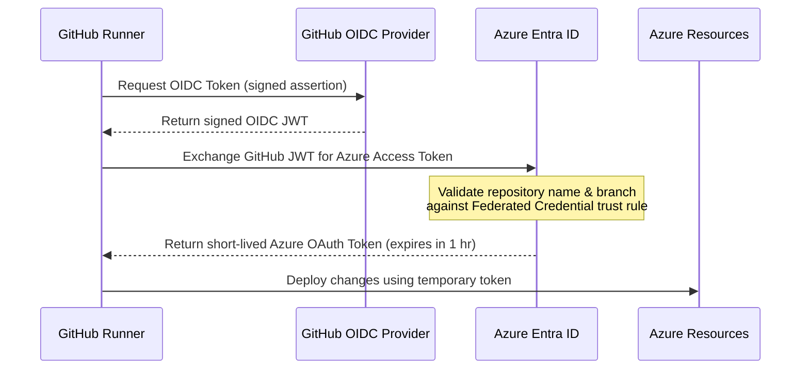

# Lesson 05: CI/CD & Security Compliance 🤖🛡️

Automation is what elevates this project to "Enterprise Grade." We use GitHub Actions workflows to automate code quality verification, security audits, container scans, and deployments.

---

## 🔑 1. OIDC: The "Secretless" GitHub Pipeline

Historically, to deploy code to Azure from GitHub, you had to generate an Azure Active Directory Service Principal Client Secret (a password), copy it, and paste it into GitHub Repository Secrets.
*   **The Risk:** If that secret was compromised, a hacker had permanent access to deploy and delete your Azure resources. The secret also had to be rotated manually every year.
*   **The Solution:** We use **OIDC (OpenID Connect) Workload Identity Federation**.

### The OIDC Handshake Sequence
Here is the step-by-step flow when our GitHub workflow deploys resources:



1.  **Request OIDC Token:** When the workflow starts, the GitHub runner requests an OIDC token from GitHub's OIDC service.
2.  **Generate GitHub JWT:** GitHub signs a JWT containing metadata about the active build (e.g., repository: `toanle88/Healthcheck`, branch: `main`, workflow run ID).
3.  **Exchange Token:** The runner contacts Azure Entra ID and presents this GitHub-signed JWT.
4.  **Validate Trust:** Azure verifies the signature and checks the **Federated Credentials** configured on our User-Assigned Managed Identity. If the repository and branch match the trust rules, the exchange is approved.
5.  **Issue Temporary Access:** Azure issues a temporary (1-hour) OAuth 2.0 access token.
6.  **Execute Deployment:** The runner deploys our Terraform or Container code. Once the job is done, the token is discarded.

---

## 🧐 2. Automated IaC Security Auditing (Checkov)

We integrate **Checkov** directly into our infrastructure pipeline (`infra.yml`) that runs on pushes that change the `infra/` directory. Checkov is an open-source static code analysis tool that scans Terraform files to catch security misconfigurations *before* they are applied to cloud resources.

### Handling Exemptions (`.checkov.yaml`)
In a real enterprise, we cannot always pass every security check. For example, Checkov warns us if we don't enable geo-redundant storage for our database. However, this is too expensive for development.

Instead of turning off the checks, we document exceptions in a central `.checkov.yaml` file:
*   We explicitly list the policy IDs we want to skip (e.g., skipping `CKV_AZURE_10` or similar rules that require enterprise features).
*   **Best Practice:** Documenting exceptions keeps our code clean, compliant, and explains *why* we bypass specific rules during security audits.

---

## 📦 3. Container Hardening (Distroless Images)

In our Go backends ([Dockerfile.api](file:///mnt/d/Dev/Projects/Healthcheck/Dockerfile.api), [Dockerfile.worker](file:///mnt/d/Dev/Projects/Healthcheck/Dockerfile.worker), [Dockerfile.migrate](file:///mnt/d/Dev/Projects/Healthcheck/Dockerfile.migrate)), we use a two-stage build. The final runner container uses a **Distroless** base image:

```dockerfile
FROM gcr.io/distroless/static-debian12:nonroot
```

Similarly, our frontend container ([Dockerfile.web](file:///mnt/d/Dev/Projects/Healthcheck/web/Dockerfile.web)) is refactored into a distroless container. Rather than employing Nginx (which executes as root and contains standard OS shells/binaries), we bundle our static React files with a lightweight custom Go webserver ([main.go](file:///mnt/d/Dev/Projects/Healthcheck/web/server/main.go)) inside the same nonroot distroless container listening on port `8080`.


### Distroless vs. Standard Images
*   **Standard Base Images (e.g., Alpine, Ubuntu):** Contain a complete operating system inside the container. They include package managers (`apk`, `apt`), shell command prompts (`sh`, `bash`), and system utility binaries (`curl`, `wget`).
*   **Distroless Images:** Contain **only** the application binary and the absolute minimum supporting runtime files (such as SSL/TLS certificates and timezone databases). They contain **no** shells, package managers, or standard system binaries.

### The Security Benefit
If an attacker exploits a code vulnerability in your Go API (e.g., finding a remote code execution bug), they will attempt to run shell commands to download malware or open a reverse connection to their control server.
*   Because our container is **Distroless**, there is no `/bin/sh` or `/bin/bash` shell to execute.
*   There is no `curl` or `wget` to download malicious scripts.
*   The container runs as the `nonroot` user, preventing privilege escalation.
*   The attack surface is virtually zero.

---

## 🔍 4. Image Security Scanning (Trivy)

Even with Distroless images, dependencies can introduce bugs or security flaws over time.
Our CI workflow integrates **Trivy**, an open-source vulnerability scanner. Trivy scans our Go dependencies and compiled container images for known CVEs (Common Vulnerabilities and Exposures) and secrets.
*   If Trivy finds a `HIGH` or `CRITICAL` vulnerability, it fails the build, preventing insecure code from ever reaching the container registry.

---

## 🚧 5. SSRF Hardening (Worker HTTP Client)

The worker pings arbitrary URLs that operators configure through the UI. Without restrictions, an attacker could register an internal URL (e.g., `http://169.254.169.254/` — the AWS/Azure metadata endpoint) and trick the worker into leaking cloud credentials.

We harden the worker's HTTP client with a custom `CheckRedirect` function:

```go
client := &http.Client{
    CheckRedirect: func(req *http.Request, via []*http.Request) error {
        if len(via) >= 3 {
            return errors.New("too many redirects (max 3)")
        }
        // Block redirects to private / loopback / link-local IP ranges
        if isPrivateIP(req.URL.Hostname()) {
            return fmt.Errorf("redirect to private IP blocked: %s", req.URL.Hostname())
        }
        return nil
    },
}
```

*   **Why it matters:** Even if a malicious target URL initially resolves to a public IP, the server could redirect to an internal address. The `CheckRedirect` hook intercepts every hop and blocks any redirect that resolves to a private, loopback, or link-local address.

---

## 🔒 6. Application Security Hardening (API & Data Protection)

We have implemented additional defense-in-depth protections on our API and frontend:
*   **Target Header Redaction:** Custom headers (such as Authorization headers or API keys) can be set on targets. The `GET /api/targets` endpoint automatically redacts the `headers` field to an empty string `""` unless the user possesses explicit `Healthcheck.Admin` claims, protecting credentials from unauthorized readers.
*   **Mock Token Hardening:** The mock E2E JWT bypass check in the middleware requires both the environment to be set to `local` AND the explicit setting of `ALLOW_MOCK_AUTH=true`. This dual-gate validation ensures testing bypass mechanisms are disabled in production or staging even if the configuration environment string is misconfigured.
*   **Hardened CSP Headers:** The new Go-based distroless frontend webserver enforces a secure Content Security Policy (CSP) that excludes `'unsafe-inline'` and unused script CDNs from the `script-src` directive, significantly boosting protection against Cross-Site Scripting (XSS).

---
 
 ### Next Steps 🚀

 Now that you understand CI/CD automation and container hardening, let's explore **[Lesson 06: W3C Distributed Tracing](file:///mnt/d/Dev/Projects/Healthcheck/docs/learn/06-w3c-distributed-tracing.md)** to see how we trace requests across services.
