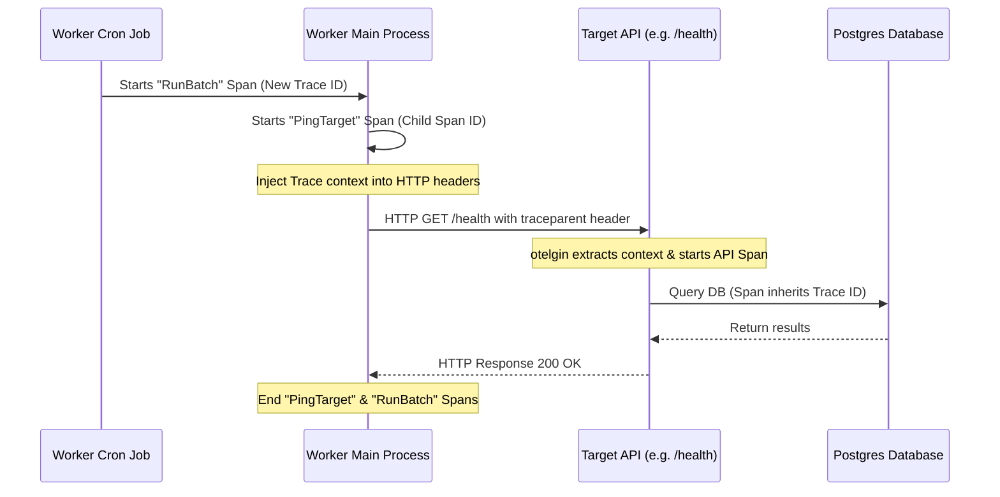

# Lesson 06: W3C Distributed Tracing 🌐🔍

In a distributed system, a single request can trigger a chain of actions across multiple services. If a database query fails or a request is slow, finding the root cause is extremely difficult without **Distributed Tracing**. 

This lesson details how the project implements end-to-end distributed tracing using **OpenTelemetry (OTel)** and the standard **W3C Trace Context** propagation protocol.

---

## 1. What is W3C Trace Context Propagation?

When the **Worker** calls the **API** (or any other service) to perform a health check, how does the API know that the request was initiated by that specific worker run? 

They coordinate using two HTTP headers defined by the W3C Trace Context specification:
1. **`traceparent`**: Links the caller and receiver. It has 4 parts:
   - `version` (currently `00`)
   - `trace-id` (32 hex characters): Identifies the entire transaction across all services.
   - `parent-id`/`span-id` (16 hex characters): Identifies the specific caller's span.
   - `trace-flags` (2 hex characters): E.g., `01` means the trace was sampled and should be recorded.
   - *Example:* `00-4bf92f3577b34da6a3ce929d0e0e4736-00f067aa0ba902b7-01`
2. **`tracestate`**: Stores vendor-specific context data (e.g., routing or tracking info).

---

## 2. Step-by-Step Context Propagation Flow

Here is the lifecycle of a trace spanning from the Worker cron trigger to the API database calls:



### Step A: Configuration (`internal/monitor/otel.go`)
Both services initialize OTel by calling `InitOTel`. In [otel.go](file:///mnt/d/Dev/Projects/Healthcheck/internal/monitor/otel.go#L80), we register the global text map propagator:
```go
otel.SetTextMapPropagator(propagation.NewCompositeTextMapPropagator(
    propagation.TraceContext{}, 
    propagation.Baggage{},
))
```
This guarantees that all services speak the same W3C Trace Context protocol when injecting or extracting headers.

### Step B: Starting the Span (`cmd/worker/main.go`)
When the background worker starts a ping check in [main.go](file:///mnt/d/Dev/Projects/Healthcheck/cmd/worker/main.go#L226), it starts a root span:
```go
tracer := otel.Tracer("healthcheck-worker")
batchCtx, span := tracer.Start(context.Background(), "RunBatch")
```
It then passes `batchCtx` into `runPingAndCheck` to start a child span:
```go
pingCtx, childSpan = tracer.Start(ctx, "PingTarget", trace.WithAttributes(...))
```

### Step C: Injection (`cmd/worker/main.go`)
Inside `pingTarget` in [main.go](file:///mnt/d/Dev/Projects/Healthcheck/cmd/worker/main.go#L310), the worker injects the current trace context from the `ctx` into the outbound HTTP request headers:
```go
otel.GetTextMapPropagator().Inject(ctx, propagation.HeaderCarrier(req.Header))
```
This appends the `traceparent` header to the HTTP request.

### Step D: Extraction (`cmd/api/main.go`)
When the API receives the request, the Gin OTel middleware in [main.go](file:///mnt/d/Dev/Projects/Healthcheck/cmd/api/main.go#L147) automatically intercepts it:
```go
r.Use(otelgin.Middleware("healthcheck-api"))
```
The middleware calls `Extract` on the request headers, parses the `traceparent` value, and attaches the active **Trace ID** to Gin's request context. Every sub-span (like the database queries or middleware validations) started within this request handler will inherit the same Trace ID, nesting themselves as children.

---

## 3. Telemetry Exporters & Visualization

We use OpenTelemetry to avoid lock-in to specific platforms. Traces are exported dynamically based on the environment:

1. **Local Development (Jaeger)**:
   Traces are sent to the Jaeger collector at `jaeger:4318` via OTLP.
   - **Access locally**: Visit `http://localhost:16686` in your browser.
   - Search for the service `healthcheck-worker` or `healthcheck-api` to view end-to-end trace flows.

2. **Azure Production (Application Insights)**:
   Traces are sent to the Application Insights ingestion endpoint using OTLP-HTTP.
   - **Access in Azure**: Navigate to Azure Portal -> Application Insights -> **Transaction Search** or **Application Map** to see the distributed trace visualizer.

---

### Next Steps 🚀
Now that you understand distributed tracing, let's explore **[Lesson 07: Entra ID Passwordless Security](file:///mnt/d/Dev/Projects/Healthcheck/docs/learn/07-entra-id-passwordless.md)** to see how we secure applications and databases without static credentials.

