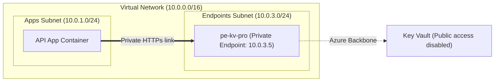

# Lesson 08: Network Isolation & Private Endpoints 🌐🔒

In standard cloud architectures, services are often given public IP addresses and secured purely at the application layer. In enterprise production environments, this is insufficient. We must enforce network-level perimeter boundaries to block unauthorized traffic before it ever reaches the application portals.

This lesson details the network architecture in production, explaining subnets, delegations, private endpoints, and security rules.

---

## 1. Subnet Allocations ("The Slices")

We define our virtual space inside a **Virtual Network (VNet)** with CIDR block `10.0.0.0/16`. In production, this VNet is sliced into three distinct subnets:

| Subnet Name | IP CIDR Range | Delegated Service | Purpose |
| :--- | :--- | :--- | :--- |
| `snet-apps` | `10.0.1.0/24` | `Microsoft.App/environments` | Container app hosting (Web, API, and Worker). |
| `snet-db` | `10.0.2.0/24` | `Microsoft.DBforPostgreSQL/flexibleServers` | Private PostgreSQL Flexible Server. |
| `snet-endpoints` | `10.0.3.0/24` | None | Private Endpoints (Key Vault, etc.). |

---

## 2. Subnet Delegation

Standard Azure subnets act as general-purpose address pools. To host specialized services like Azure Container Apps (ACA) or PostgreSQL Flexible Server inside our VNet, we must *delegate* the subnet:
- **ACA Delegation:** Allocates control of `snet-apps` to `Microsoft.App/environments`. This allows Azure to bind virtual network interfaces (NICs) of the container instances directly into our subnet.
- **Postgres Delegation:** Allocates control of `snet-db` to `Microsoft.DBforPostgreSQL/flexibleServers`. This blocks any other resource type from provisioning in `snet-db` and gives Postgres direct VNet connectivity.

---

## 3. Private Endpoints & Key Vault Hardening

Azure Key Vault by default has a public endpoint, meaning it can be reached over the internet if the attacker knows its URL and has valid credentials. In production, we disable public access completely.

### Key Vault Hardening Steps
1. **Disable Public Network Access:** The parameter `public_network_access_enabled` is set to `false`.
2. **Default Action set to Deny:** If any traffic bypasses the rule, the default firewall behavior denies all access unless explicitly listed in network rules.
3. **Private Endpoint Integration:** We create a **Private Endpoint** (`pe-kv-pro`) inside our `snet-endpoints` subnet. The Private Endpoint allocates a private IP (e.g. `10.0.3.5`) inside our network card interface. 
4. **Private DNS Zone Link:** We provision a Private DNS Zone for `privatelink.vaultcore.azure.net` and link it to our VNet. This ensures that when the API calls `https://kv-healthcheck-pro.vault.azure.net/`, the request resolves to the private IP address (`10.0.3.5`) instead of a public IP.

---

## 4. Restrictive NSG Rules (Least Privilege)

**Network Security Groups (NSGs)** act as stateful firewalls at the subnet boundary. We enforce strict rules to prevent lateral movement (if one container is compromised, the attacker cannot scan or access other subnets):

### A. Apps Subnet NSG (`nsg-apps`)
- **Block Public HTTP (Port 80):** In production, we deny all inbound traffic on port 80, forcing HTTPS (443) traffic.
- **Block SSH (Port 22):** Deny all inbound SSH attempts from the internet to satisfy Checkov compliance audits (`CKV_AZURE_10`).

### B. Database Subnet NSG (`nsg-db`)
- **Isolate Port 5432:** We add an inbound rule that allows traffic on PostgreSQL port `5432` **only** if the traffic originates from the apps subnet IP range (`10.0.1.0/24`). All other traffic (including requests from the endpoints subnet or outside the VNet) is explicitly blocked.

### C. Endpoints Subnet NSG (`nsg-endpoints`)
- **Isolate Port 443:** Key Vault private endpoints communicate on port 443. We add a rule that allows inbound 443 connections **only** from the apps subnet (`10.0.1.0/24`). No other service inside or outside the VNet can connect to the Key Vault endpoint (`CKV2_AZURE_31`).

---

### Next Steps 🚀
Now that you understand network isolation, let's explore **[Lesson 09: CI/CD Quality Gates & Automated Rollbacks](file:///mnt/d/Dev/Projects/Healthcheck/docs/learn/09-cicd-quality-gates.md)** to see how we prevent bad code and automate deployment recovery.

