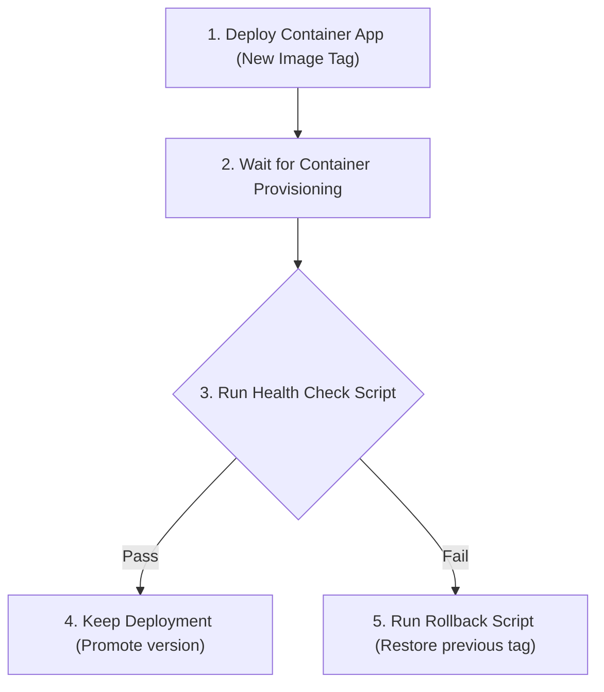

# Lesson 09: CI/CD Quality Gates & Automated Rollbacks 🤖🔄

In a production-ready DevOps lifecycle, deploying code must be completely automated, but it must also be safe. We cannot rely on manual QA to catch bugs. Instead, we implement **Quality Gates** in the CI pipeline to block bad code and **Automated Rollbacks** in the CD pipeline to revert changes if the live deployment fails.

This lesson details the integration of quality validation gates and container rollbacks in our automation pipelines.

---

## 1. CI Quality Gates (Linting & Code Coverage)

Every time a developer opens a Pull Request or pushes code, our GitHub Actions pipelines trigger. The build must pass several automated gates:

### A. Static Code & IaC Scans
- **Checkov:** Scans our Terraform codebase for security misconfigurations. If any resource violates a rule (such as public access enabled on a Key Vault), the build is failed.
- **SonarQube / SonarCloud:** Performs static analysis on the Go and TypeScript code to catch bugs, vulnerabilities, and code smells. It enforces a strict **Quality Gate** profile.

### B. Code Coverage Gates
To ensure our tests are comprehensive, our CI pipeline enforces a minimum unit test coverage threshold:
1. In Go, we run tests and generate a coverage report:
   ```bash
   go test -coverprofile=coverage.out ./...
   ```
2. The pipeline parses `coverage.out` and calculates the statement coverage percentage.
3. If the coverage falls below the required threshold (e.g. **80%**), the pipeline fails. This prevents developers from merging features without writing matching unit tests.

---

## 2. Release Validation & Automated Rollbacks

Once a build passes CI, the container images are pushed to the Azure Container Registry (ACR), and the release pipeline triggers to deploy the changes to Azure Container Apps. 

To guarantee service availability, the release pipeline runs a **Post-Deployment Health-Checking Script**:



### The Post-Deployment Health Check Script
Immediately after deploying the new container version, the release runner executes a validation script (e.g., a script targeting the `/health` endpoint):
- It pings the new container deployment multiple times over a 2-minute window to check if it returns `200 OK`.
- It verifies that crucial internal systems (database connectivity, config loading) are operational.

### The Automated Rollback Logic
If the post-deployment script detects failure (e.g., the endpoint returns a `500 Server Error` or times out because of a broken configuration or database migration):
1. **Interrupt Release:** The deployment is flagged as unhealthy.
2. **Fetch Previous Version:** The script queries the container registry or deployment history to get the last stable container image tag (e.g., `v1.2.0`).
3. **Execute Revert:** The pipeline executes an update command to point the Container App back to the last stable tag:
   ```bash
   az containerapp update \
     --name app-healthcheck-api-pro \
     --resource-group rg-healthcheck-pro \
     --image acrhealthcheckpro.azurecr.io/api:v1.2.0
   ```
4. **Zero-Downtime:** Because Azure Container Apps uses revision-based routing, the traffic is kept on the old, working container revision until the new version is healthy. If the new version is marked broken, traffic is never routed to it, resulting in zero-downtime for users.

---

### Next Steps 🚀
Congratulations! You have completed the entire learning path. Return to the **[Learning Path Index](file:///mnt/d/Dev/Projects/Healthcheck/docs/learn/README.md)** or read the repository onboarding notes in the **[README](file:///mnt/d/Dev/Projects/Healthcheck/README.md)**.

