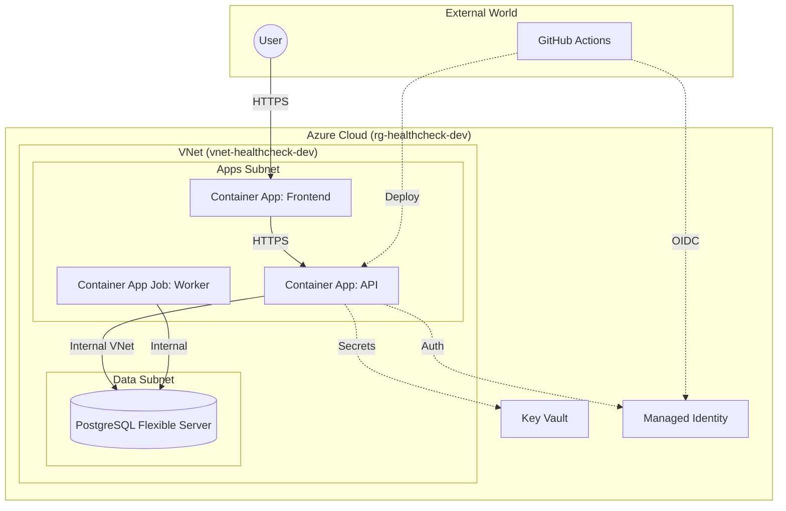

# Lesson 01: Architecture Overview 🗺️

Welcome to the deep dive! Before we look at the code, we need to understand the "Big Picture." This project isn't just a simple app; it's a **Production-Ready Microservices Ecosystem**.

## The High-Level Architecture

Our system is built on four core pillars: **Identity**, **Compute**, **Data**, and **Security**.

## Core Design Principles

### 1. Zero-Secret Architecture 🔐
The most important rule in this project: **No passwords allowed.** 
- We don't store the DB password in a config file.
- We don't store it in an environment variable.
- Instead, the Go application uses its **Managed Identity** to request a temporary token from Entra ID to log into the database.

### 2. VNet Injection (The "Private Room") 🛡️
Your database isn't floating around on the public internet. It is "Injected" into a Virtual Network. 
- The only way to talk to the database is to be *inside* that network.
- This prevents 99% of common cyber-attacks because the database simply has no public IP address.

### 3. Event-Driven & Scalable 🚀
- **The API** handles requests. It "Scales to Zero" when no one is using it, saving you money.
- **The Worker** is a "Job." It wakes up, does its work, and disappears. It’s the ultimate way to handle background tasks without wasting resources.

### 4. Infrastructure as Code (IaC) 🏗️
Everything you see in the diagram above was created with **Terraform**. If you delete the entire resource group, you can rebuild this whole world in under 15 minutes with one command.

---

### Next Steps
In the next lesson, we’ll open up the `cmd/` and `internal/` folders to see how the Go application actually implements these principles.
