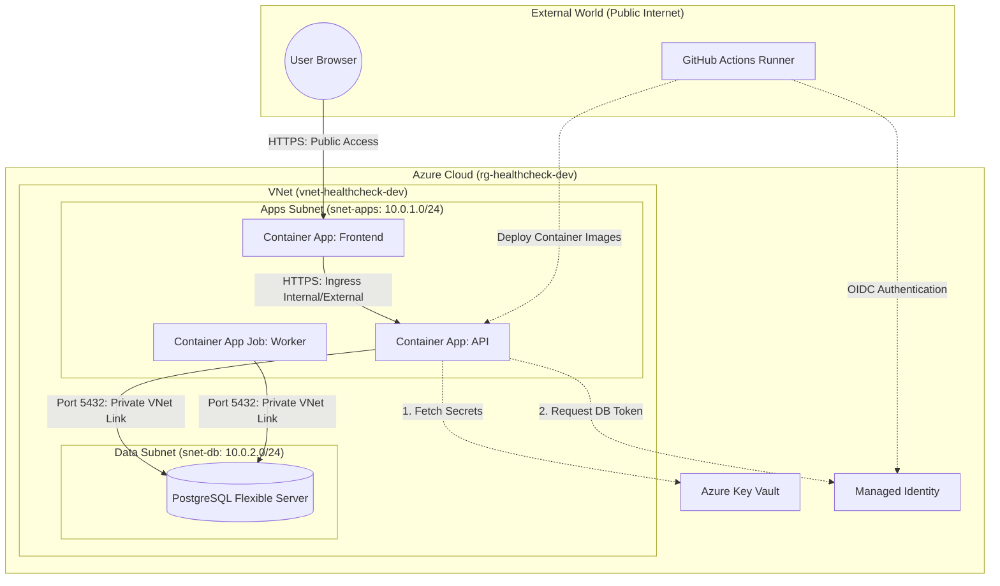

# Lesson 01: Architecture Overview 🗺️

Welcome to the deep dive! Before we write any code or deploy any cloud resources, we must understand the "Big Picture." This project is not just a simple web application; it represents a production-grade, highly secure **Microservices Ecosystem** deployed in the cloud.

---

## 🏗️ The High-Level Architecture

Here is the architectural blueprint of what we are building. The system partitions components based on the security principles of **Identity**, **Compute**, **Data**, and **Isolation**.

---

## 🔍 Detailed Component Breakdown

For a developer new to cloud architectures, the terms above can feel overwhelming. Let’s break down what each block is and why it exists:

### 1. Resource Group (`rg-healthcheck-dev`)
Think of a **Resource Group** as a logical folder in your Azure subscription. It does not run any code itself, but it groups all related resources (VNet, database, containers, key vaults) together.
* **Why it matters:** It makes lifecycle management simple. If you want to delete the entire staging or development environment to save costs, you delete this single resource group, and everything inside it is destroyed clean.

### 2. Virtual Network (VNet) & Subnets
A **Virtual Network (VNet)** is your private sandbox in the cloud. It is isolated from the public internet.
* **IP Address Allocation:** We assign a range of private IP addresses (like `10.0.0.0/16`, which gives us 65,536 private IPs) that can only be reached within this network.
* **Subnets:** We slice the VNet into smaller segments (subnets) for different security tiers:
  * **Apps Subnet (`snet-apps`)**: Where our containers run.
  * **Data Subnet (`snet-db`)**: Where our database lives.
* **Isolation:** By isolating the database in its own subnet, we can configure rules that say: *"Only containers inside the Apps Subnet are allowed to talk to the database. All other traffic is blocked."*

### 3. Managed Identity
In traditional hosting, if your app needs to talk to a database or key vault, you write a username and password in a configuration file. If that file is accidentally committed to GitHub, your entire business is compromised.
* **What is it?** A **Managed Identity** is an identity created in Microsoft Entra ID (formerly Azure Active Directory) that is tied directly to a specific cloud resource (like our API Container).
* **How it works:** The container app queries an internal Azure metadata service (`http://169.254.169.254/metadata/identity/oauth2/token`) that only runs inside that container. Azure verifies the container's identity and hands back a short-lived (1-hour) token. No passwords ever exist in our codebase!

### 4. Azure Key Vault (KV)
This is a secure, hardware-backed vault designed to store secrets, keys, and certificates.
* **Access Control:** We don't use passwords to read the Key Vault. Instead, we use **Azure RBAC (Role-Based Access Control)** to grant our Managed Identity the `Key Vault Secrets User` role. Only our application is allowed to read the configuration keys it needs to boot.

### 5. Azure Container Apps (ACA)
ACA is a fully managed serverless container service built on top of Kubernetes (K8s) and KEDA (Kubernetes Event-driven Autoscaling).
* **The API / Frontend (Apps)**: These run continuously or scale dynamically based on web traffic.
* **The Worker (Job)**: This is a task that does not listen on a port. It runs on a cron schedule, wakes up to perform health checks, inserts the results into the database, and immediately terminates to save computing costs.

---

## 🛡️ Core Design Principles

When designing and building modern cloud-native systems, we adhere to four critical principles:

### 1. Zero-Secret Runtime 🔐
We operate under the assumption that *any hardcoded credential will eventually be leaked*.
* We do not store database passwords in `.env` files.
* We do not write connections strings with cleartext passwords.
* Instead, our Go application uses its **Managed Identity** to request a temporary access token from Entra ID specifically scoped for PostgreSQL. This token acts as the database password and expires automatically.

### 2. Private Subnet Injection (Network Sandboxing) 🚧
A database should never have a public IP address.
* Our PostgreSQL server is "injected" into `snet-db`.
* There is no route from the public internet to this database.
* Even if someone knows the database hostname and has a valid password, they cannot connect unless they are executing code *inside* the VNet.

### 3. Event-Driven & Scalable Architecture 🚀
* **Scale-to-Zero:** If no users are viewing the dashboard, our Container Apps scale down to 0 replicas. This means we pay $0 for CPU/Memory during idle hours.
* **Automatic Scaling:** As soon as HTTP requests arrive, ACA dynamically spins up replicas to handle the load and scales back down when the spikes subside.

### 4. Infrastructure as Code (IaC) 🏗️
Human error is the leading cause of cloud misconfigurations.
* Every virtual network, firewall rule, role assignment, and database parameter is defined in **Terraform** files.
* This makes our infrastructure fully auditable, version-controlled, and reproducible in minutes.

---

## 📖 Glossary of Terms for Beginners

| Term | Analogy | Description |
| :--- | :--- | :--- |
| **VNet** | A fenced castle | A private, isolated network space in the cloud. |
| **Subnet** | Rooms inside the castle | A split division within a VNet for grouping related services. |
| **Managed Identity** | A building access badge | An auto-managed identity in Entra ID used by services to authenticate securely. |
| **OIDC** | A temporary guest pass | OpenID Connect, allowing third-parties (like GitHub) to authenticate temporarily. |
| **Checkov** | A building inspector | An static analysis tool that scans Terraform files for security vulnerabilities. |
| **Distroless** | A bare room with just a desk | A minimal container image containing only your binary, removing standard tools like shell/bash to prevent attacks. |

---

### Next Steps 🚀
Now that you have a firm grasp of the environment structure, let's explore **[Lesson 02: Go Microservices](file:///mnt/d/Dev/Projects/Healthcheck/docs/lessons/02-go-microservices.md)** to see how Go translates these concepts into working code.
