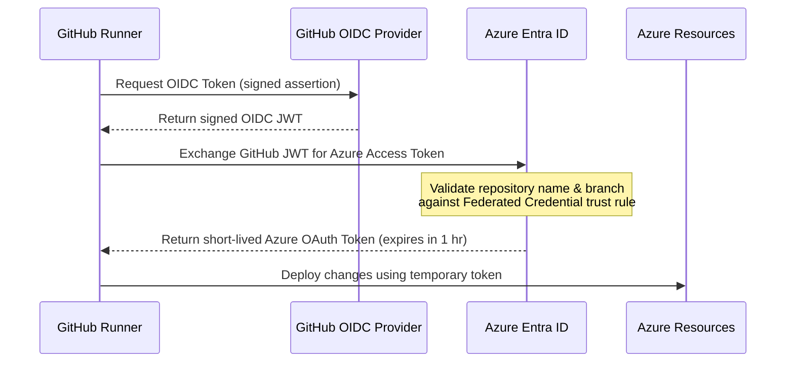

# Lesson 05: CI/CD & Security Compliance 🤖🛡️

Automation is what elevates this project to "Enterprise Grade." We use GitHub Actions workflows to automate code quality verification, security audits, container scans, and deployments.

---

## 🔑 1. OIDC: The "Secretless" GitHub Pipeline

Historically, to deploy code to Azure from GitHub, you had to generate an Azure Active Directory Service Principal Client Secret (a password), copy it, and paste it into GitHub Repository Secrets.
*   **The Risk:** If that secret was compromised, a hacker had permanent access to deploy and delete your Azure resources. The secret also had to be rotated manually every year.
*   **The Solution:** We use **OIDC (OpenID Connect) Workload Identity Federation**.

### The OIDC Handshake Sequence
Here is the step-by-step flow when our GitHub workflow deploys resources:



1.  **Request OIDC Token:** When the workflow starts, the GitHub runner requests an OIDC token from GitHub's OIDC service.
2.  **Generate GitHub JWT:** GitHub signs a JWT containing metadata about the active build (e.g., repository: `toanle88/Healthcheck`, branch: `main`, workflow run ID).
3.  **Exchange Token:** The runner contacts Azure Entra ID and presents this GitHub-signed JWT.
4.  **Validate Trust:** Azure verifies the signature and checks the **Federated Credentials** configured on our User-Assigned Managed Identity. If the repository and branch match the trust rules, the exchange is approved.
5.  **Issue Temporary Access:** Azure issues a temporary (1-hour) OAuth 2.0 access token.
6.  **Execute Deployment:** The runner deploys our Terraform or Container code. Once the job is done, the token is discarded.

---

## 🧐 2. Automated IaC Security Auditing (Checkov)

We integrate **Checkov** directly into our Pull Request (`ci.yml`) pipeline. Checkov is an open-source static code analysis tool that scans Terraform files to catch security misconfigurations *before* they are applied to cloud resources.

### Handling Exemptions (`.checkov.yaml`)
In a real enterprise, we cannot always pass every security check. For example, Checkov warns us if we don't enable geo-redundant storage for our database. However, this is too expensive for development.

Instead of turning off the checks, we document exceptions in a central `.checkov.yaml` file:
*   We explicitly list the policy IDs we want to skip (e.g., skipping `CKV_AZURE_10` or similar rules that require enterprise features).
*   **Best Practice:** Documenting exceptions keeps our code clean, compliant, and explains *why* we bypass specific rules during security audits.

---

## 📦 3. Container Hardening (Distroless Images)

In our [Dockerfile.api](file:///mnt/d/Dev/Projects/Healthcheck/Dockerfile.api), we use a two-stage build. The final runner container uses a **Distroless** base image:

```dockerfile
FROM gcr.io/distroless/static-debian12:nonroot
```

### Distroless vs. Standard Images
*   **Standard Base Images (e.g., Alpine, Ubuntu):** Contain a complete operating system inside the container. They include package managers (`apk`, `apt`), shell command prompts (`sh`, `bash`), and system utility binaries (`curl`, `wget`).
*   **Distroless Images:** Contain **only** the application binary and the absolute minimum supporting runtime files (such as SSL/TLS certificates and timezone databases). They contain **no** shells, package managers, or standard system binaries.

### The Security Benefit
If an attacker exploits a code vulnerability in your Go API (e.g., finding a remote code execution bug), they will attempt to run shell commands to download malware or open a reverse connection to their control server.
*   Because our container is **Distroless**, there is no `/bin/sh` or `/bin/bash` shell to execute.
*   There is no `curl` or `wget` to download malicious scripts.
*   The container runs as the `nonroot` user, preventing privilege escalation.
*   The attack surface is virtually zero.

---

## 🔍 4. Image Security Scanning (Trivy)

Even with Distroless images, dependencies can introduce bugs or security flaws over time.
Our CI workflow integrates **Trivy**, an open-source vulnerability scanner. Trivy scans our Go dependencies and compiled container images for known CVEs (Common Vulnerabilities and Exposures) and secrets.
*   If Trivy finds a `HIGH` or `CRITICAL` vulnerability, it fails the build, preventing insecure code from ever reaching the container registry.

---

## 🏁 Walkthrough Completed! 🏆

Congratulations! You have completed the architecture and implementation lessons. You now possess a deep understanding of:
1.  **Architecture:** Setting up secure network zones (VNet/Subnets) and identity authentication patterns.
2.  **Go Development:** Wiring up passwordless database connections and tracing using OpenTelemetry.
3.  **Infrastructure as Code:** Modeling secure network environments and policies with Terraform.
4.  **Container Services:** Deploying, scaling, and monitoring applications serverlessly with Azure Container Apps.
5.  **CI/CD:** Hardening build pipelines and containers using OIDC, Checkov, Trivy, and Distroless base configurations.

---

### Back to Overview 🗺️
You can review the first lesson at **[Lesson 01: Architecture Overview](file:///mnt/d/Dev/Projects/Healthcheck/docs/lessons/01-architecture-overview.md)** or read the full repository onboarding notes in the **[README](file:///mnt/d/Dev/Projects/Healthcheck/README.md)**.
